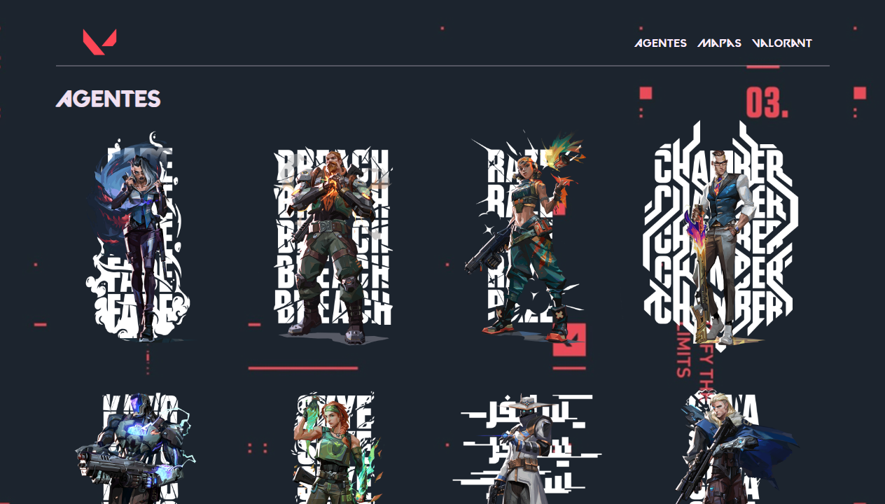
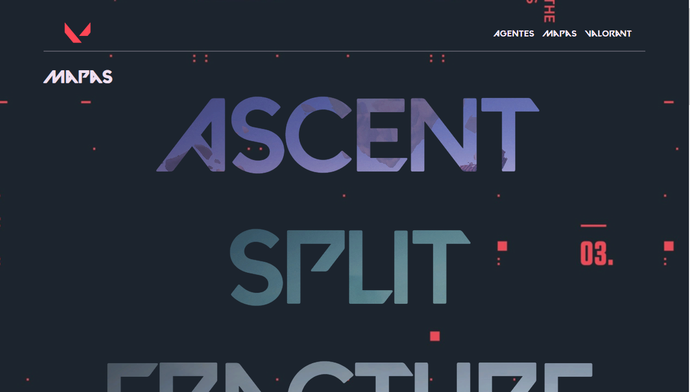

<h1 align="left"> Valorant</h1>
<h3>O que é este Projeto?</h3>

  <strong>BR</strong> Valorant é um famoso jogo online que disponibiliza uma divertida API para consumo no front-end, nela podemos pagar todo e qualquer asset do jogo através do retorno dos endpoints da API, assim podemos desenvolver projetos únicos e diversos!

  <strong>US</strong> Valorant is a famous online game that provides a fun API for consumption on the front-end, in which we can pay for any and all game assets through the return of the API endpoints, so we can develop unique and diverse projects!

<h2 align="left">🖼️ Screenshots</h1>

<h2 align="left">👨‍💻 Technologies</h1>

  
  
  
  
  

<h2 align="left">👨‍🔧 API</h1>

A API utilizada no projeto é a <a href="https://valorant-api.com">Valorant API </a>

<h2>🔗 Acesse meu projeto</h2>

Este repositório está no Vercel <a href="https://valorant-three.vercel.app">Confira!</a>

